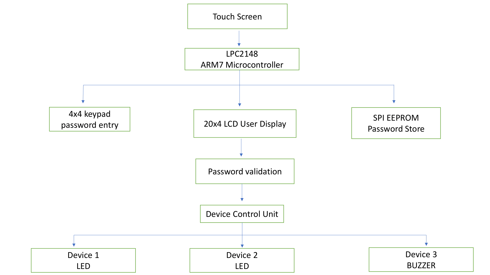

# Touch-Based Device Control System for Bedridden Patients

## Overview

The **Touch-Based Device Control System for Bedridden Patients** is an assistive embedded system designed to improve the independence and quality of life of patients with limited mobility. The system enables users to control essential electronic devices through a simple touch-based interface, eliminating the need for physical movement or external assistance.

Built around the **LPC2124 ARM7 Microcontroller**, the system integrates a touch screen, LCD display, keypad, EEPROM memory, and multiple output devices to provide a secure and user-friendly control environment. To prevent unauthorized access, the system incorporates a password authentication mechanism where user credentials are securely stored in EEPROM through SPI communication. Only authenticated users can access the device control interface.

The touch screen acts as the primary input device, allowing patients to turn connected devices ON or OFF with a simple touch. Real-time system status and user instructions are displayed on the LCD, ensuring ease of operation. The keypad is used for password entry and password modification, while an interrupt-driven mechanism enables secure password updates without disrupting normal system functionality.

This project demonstrates the practical application of Embedded C programming, microcontroller interfacing, SPI communication, UART communication, EEPROM memory management, interrupt handling, and human-machine interface design. The proposed system can be deployed in hospitals, rehabilitation centers, elderly care facilities, and smart home environments to provide greater convenience, accessibility, and autonomy for physically challenged and bedridden individuals.


## Block Diagram

<p align="center">
  
</p>

## Project Images


## Features
- Touch-based device control
- Password-protected access
- EEPROM-based password storage
- Password modification using external interrupt
- LCD display for user interaction
- Matrix keypad for password entry
- SPI communication with EEPROM
- UART communication support
- LED and buzzer control
- Interrupt-driven operation

## Hardware Requirements
- LPC2124 ARM7 Microcontroller
- Resistive Touch Screen
- 16x2 LCD Display
- 4x4 Matrix Keypad
- SPI EEPROM
- LEDs
- Buzzer
- Power Supply

## Software Requirements
- Embedded C
- Keil uVision
- Flash Magic
- Proteus (Optional for Simulation)

## Working Principle
1. User enters a valid password through the keypad.
2. Password is verified using EEPROM-stored credentials.
3. Upon successful authentication, the touch interface is enabled.
4. Users can control connected devices through predefined touch regions.
5. Password can be changed securely through an interrupt-based password update mechanism.
6. Updated passwords are stored permanently in EEPROM.

## Modules Used
- LCD Interface
- Keypad Interface
- Touch Screen Interface
- UART Communication
- SPI EEPROM Interface
- External Interrupts
- Device Control Module


## Project Structure

```text
Touch-Based-Device-Control-System
│
├── projectmain.c
├── devices.c
├── devices.h
├── lcd.c
├── lcd.h
├── kpm.c
├── kpm.h
├── SPI.c
├── SPI.h
├── password.c
├── password.h
├── interrupt.c
├── interrupt.h
├── delay.c
├── delay.h
├── lcd_defines.h
├── SPI_defines.h
├── kpmdefines.h
├── define.h
├── pinconnectblock.c
├── pinconnectblock.h
├── types.h
├── block_diagram.png
└── README.md
```


## Applications
- Smart Hospital Rooms
- Patient Assistance Systems
- Home Automation
- Elderly Care Systems
- Assistive Healthcare Devices

## Future Enhancements
- Wireless device control
- IoT integration
- Mobile application support
- Voice-controlled operation
- Cloud-based monitoring

## Technologies Used
- Embedded C
- LPC2124 ARM7
- SPI Protocol
- UART Communication
- EEPROM Memory
- Interrupt Programming


